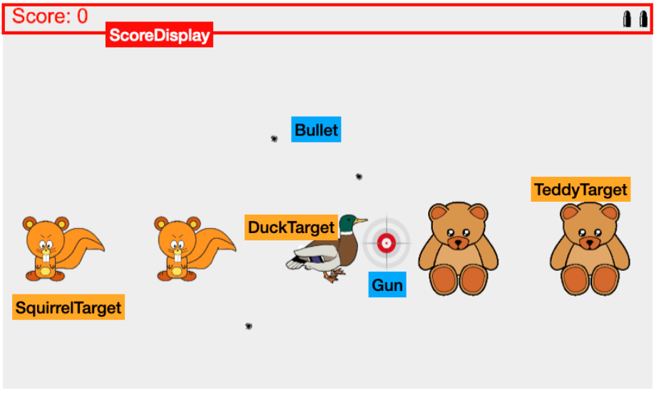
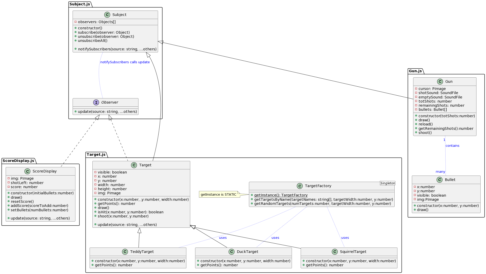
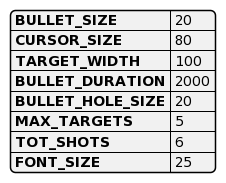
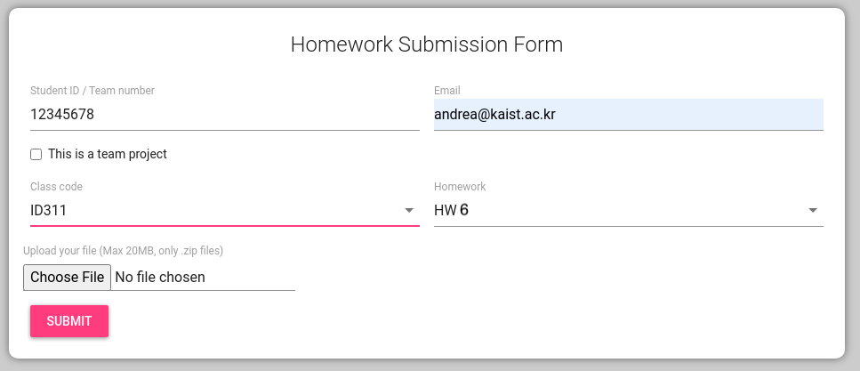

# Homework 5 - Software Prototyping ID311

- **Deadline: April 18th, 2022 at 11:59 pm**
- _[Live demo](http://hw5demo.surge.sh)_

## General Description

In this assignment, you will practice with **classes, inheritance, and Object-Oriented Programming (OOP) patterns**, by implementing a simple _shooting game_. The assignment will also familiarize you with loading and playing sounds, timeout, reading UML class diagrams, and writing code that interfaces with pre-existing code (the `main.js` written by the instructor).

**NOTE**: there could be unwanted delays in the demo due to the fact that images and sounds are loaded. Please ignore delays (they were not meant).

<p align="center">

</p>

The application consists of a **shooting game**, with different elements represented by different classes. The image above shows the game and an overlay identifying the different components (i.e., classes) of the game.

The mouse acts like a gun that you can shoot with the left button of the mouse. When you shoot, a bullet hole appears for 2 seconds and then disappears. At every gunshot, the bullet counter (top right) is decremented by one. If you hit a target, the target disappears, and the score is incremented. Once all bullets are used, you can no longer shoot a target and the trigger produces the sound of an empty gun. By pressing the spacebar, you reset the score and reload the gun.

## Getting started with Vite and the code stubs

The files `index.html` and `main.js` contain a minimal stub to get you started.

To start developing with _Vite.js_, open the terminal and type once

```bash
npm install
npm run dev
```

The app will be previewed on the local server on port `3000`.

## Requirments

- **Implements all the classes and methods** as specified in the UML diagram below.
- You cannot modify `main.js` - you can only **uncomment** the code once you have implemented the methods called there.
- You can add more classes, functions, or methods to classes, _but, if you do so, you have to document them_ with a UML diagram to be included in your final submission.

## Overview

<p align="center">

</p>

You are required to implement several classes, across several files, as seen in the [image above](assets/uml_classes.png). The diagram above is full of details: **read it carefully**!

### Classes

#### ScoreDisplay

The `ScoreDisplay` appears on the screen as a textual score with the Arial font size 25 (top left) and a set of images of bullets (top right) representing the shots left in the gun. Each of the bullets is drawn using the same bullet.png image (all images are in the folder `data`).

#### Bullet

Each `Bullet` is drawn using the `bulletHole.png` image. It appears only for two seconds when the gun is shot, and then it becomes invisible. You can use `setTimeout` to make the image disappear.

#### Gun

The `Gun` is the mouse. To draw it, hide the cursor with the `noCursor` function and then draw instead the image `cursor.png` at the location of the mouse. To load and play sounds with p5.js take a look at [this example](https://p5js.org/examples/sound-load-and-play-sound.html). The sound files are `shot.mp3` and `empty.mp3`, depending on whether there are still shots available. Finally, when you shoot with the gun, add a random `CURSOR_SIZE` noise (or a similarly small amount) to alter the bullet's final hitting location.

#### Target

`Target` (base class) and the derived classes `TeddyTarget`, `DuckTarget`, `SquirrelTarget` represents shootable targets. The Target class takes care of everything, except for loading the correct image and returning the number of points associated with each derived target. TeddyTarget gives **1** point, DuckTarget **3** points and SquirrelTarget gives **5** points. Targets return points only if visible (e.g. not previously hit).

#### TargetFactory

Instead of creating directly the Targets, we use a factory class. Inside there is a static `getInstance` method (the _factory_ is a _singleton_). The other two methods should return an array of targets either randomly or based on specified names. The maximum number of targets is **5** (see the `Constants.js` file).

### Patterns

#### Factory and Singleton

`TargetFacotry` is both a **singleton** and a **factory**.

- A singleton requires the class to be unique, hence implement the static method `getInstance` which returns the only available instance of the class.
- The factory methods (`getTargetsByName(targetNames, targetWidth, y)` and `getRandomTargets(numTargets, targetWidth, y)` require to specify the _targetWidth_, the _y_ location of the target on the screen, and either an array of _names_ (e.g., ['teddy', 'duck', 'squirrel'...] or a _number_ of desired random targets).

#### Observer

A `Subject` is an observable object. Observers who `subscribe` to a subject are notified when an event happens. For example, both the ScoreDisplay and the targets will be notified anytime the gun shoots. The ScoreDisplay will also be notified whenever a target is hit (`Target` is both a Subject and an observer).

To be an Observer, an object must implement the method `update` which takes as input a string with the source of the event, and a variable number of parameters grouped with the _rest operator_.

For example, the gun, when shot, will trigger an event similar to this one:

```js
this.notifySubscribers('gun', x, y, remainingShots);
```

... and score display will receive and handle the event:

```js
update(source, ...others) {
    if (source == 'gun') {
      // ... others contains the data we need
    } else if (source == '...')
      //...
    }
    // ...
}
```

### Constants

Few constants are specified on the `Constants.js` file. These are useful for drawing with correct dimensions. Feel free to include and use the constants in this file.

<p align="center">

</p>

---

## About grading

The maximum score for this assignment is 100 points, divide this way:

1. **Git**: Submit your local repository with your code (the hidden .git folder). There should be at least 10 commits in a branch called `develop`, which is finally merged back to `main` (10%).
2. **Gun** shoot **bullets**, which are correctly displayed (10%)
3. **Targets** are correctly implemented with inheritance and can be shot (20%)
4. **ScoreDisplay** is correclty updates (10%)
5. **Singleton** pattern correctly implemented (10%)
6. **Factory** pattern correctly implemented (20%)
7. **Observer** pattern correctly implemented (20%)

If the program does not compile (e.g., not a valid javascript file) the score is 0. If it runs, the score is inversely proportional to the number of errors. If the code has runtime errors (crash), there is a 20 points penalty, plus a penalty for any additional part that cannot be checked.

## How to submit

<p align="center">

</p>

1. After completing your code, make sure to fill up the [SubmissionNotes](./SubmissionNotes.md) with your basic info and indicate whether you received any help. Feel free to add any relevant information.
2. Zip the folder of this repository containing your solution and the `.git` repository folder.
3. Do not include the `node_modules` folder. You can simply delete it.
4. Submit the homework using the class [submission system](https://homework.prototyping.id). Choose `HW5`.
5. For any problem feel free to contact the professor or TA via Discord.

**NOTES**

- _Only_ submissions made with the system will be considered (e.g., no direct emails to TA or Prof).
- You can re-submit as many times as you want: the last submission only will be considered.
- Submissions after the deadline (even a few minutes) will receive a penalty of 50%. Submissions submitted after 24 hours from the deadline will be ignored (score will be 0).
- Keep a screenshot that proves your completed submission.
- Coding style might be considered in grading.
