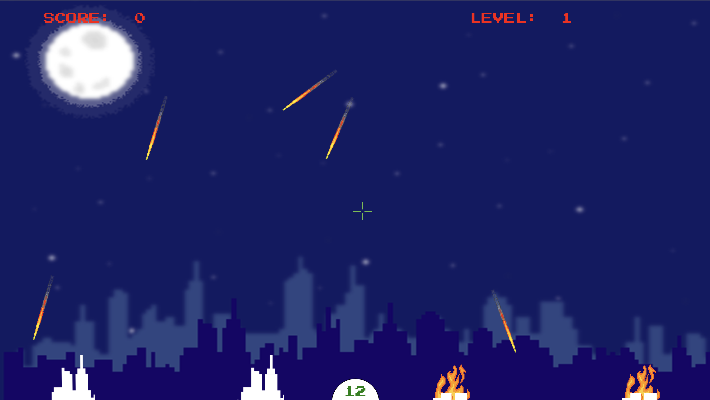
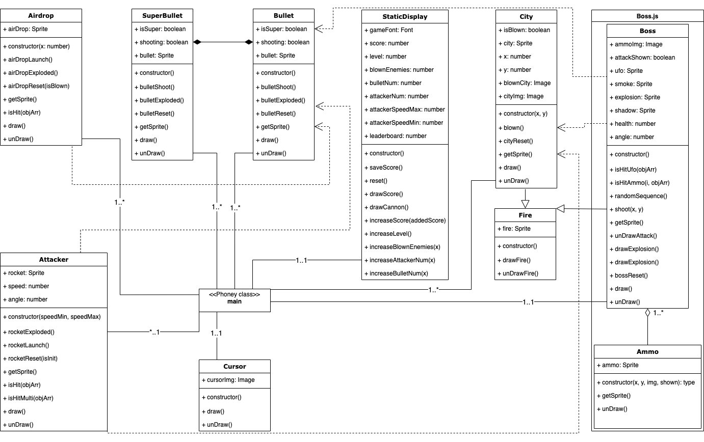
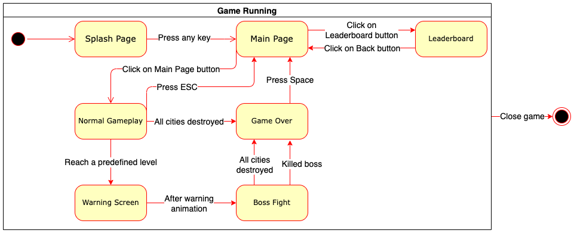

## Table of contents

- [ID311 Individual project submission form](#id311-individual-project-submission-form)
- [Game Description](#game-description)
  - [1. The story](#1-the-story)
  - [2. The game mechanics](#2-the-game-mechanics)
    - [*Game control*](#game-control)
    - [*Game mission*](#game-mission)
    - [*Game objects*](#game-objects)
    - [*Notes*](#notes)
- [Code Description](#code-description)
  - [1. Techstack](#1-techstack)
  - [2. Class Structure](#2-class-structure)
    - [**Airdrop**](#airdrop)
    - [**Attacker**](#attacker)
    - [**Cursor**](#cursor)
    - [**Bullet**](#bullet)
    - [**SuperBullet**](#superbullet)
    - [**Fire**](#fire)
    - [**City**](#city)
    - [**Boss**](#boss)
    - [**Ammo**](#ammo)
    - [**StaticDisplay**](#staticdisplay)
    - [**main**](#main)
  - [3. Game States](#3-game-states)
- [Highlight](#highlight)
- [Acknowledge](#acknowledge)
---
# ID311 Individual project submission form

1. **Name**: Nguyen Ba Vinh Quang
2. **KAIST ID**: 20190710
3. **Email**: nbvquang99@kaist.ac.kr / nbvquang99@gmail.com
4. **GIT URL**: [Click here](https://github.com/nbvquang99/ID311-Individual-Project)
5. **Youtube Demo Video**: [Click here](https://youtu.be/T5KPD_Y2Cfg)
   
# Game Description

  

## 1. The story
My first proposal is a 2D game with a single button to control the character - Itachi. Itachi will run on an endless road where the enemy will be spawned randomly, the player has to control Itachi to dodge the enemy's attacks as well as obstacles. It likes the Dinosaur game in Chrome.

However, due to lacking Sprite assets to create character movement as well as the improvement idea for the game. I decide to switch my project to the Missile Command Game. As the name, your mission in the game is to control a missile launcher to defend four cities from attackers (rockets and UFOs).

<em>Gameplay</em>

## 2. The game mechanics
*In this section, briefly describe game features (for more details and visualization, please refer to [Demo Video](https://youtu.be/T5KPD_Y2Cfg)).*
### *Game control*
- Aiming by `Mouse` dragging. `Left mouse` to shoot a normal missile. `Right mouse` to shoot a special missile.
### *Game mission*
- We have to protect four cities from enemies which will be spawned randomly and fall down from the top of the screen, the player has to control the missile to hit enemies.
- The more enemy we destroy, the more scores and levels we earn. To increase one level, **10 enemies** must be destroyed. At each level, the number and speed of enemies will increase. Therefore, it will be more difficult in the later game.
- The player will lose if all four cities are destroyed.
### *Game objects*
- `The enemies` include normal rockets and a UFO which is the **Boss** of the game. 
- `The UFO boss` has a unique type of bullet to attack our cities, these bullets are blue spheres that are inspired by Naruto's Rasengan Skills. We can hit both the boss and its bullets. During the low health status, the boss will be fuming.
- `The airdrop` will be randomly spawned during the gameplay, hit it to gain the number of our missiles.
- `Leaderboard` system that stores the top 5 highest scores through multiple gameplays.
### *Notes*
- In order to make a short video demo, I set up the game so that the player only needs to reach **level 3** to fight with the UFO boss. The player is victorious after defeating the boss.

# Code Description
## 1. Techstack
- Javascript with OOP and Pattern design.
- Libraries: p5.js and p5play.

## 2. Class Structure

<em>Class Diagram</em>

### **Airdrop**
Loading airdrop image to an Animation of a Sprite object. Then draw it at location of `(x, y); x = random(width), and y = -10`. An airdrop Sprite can be launched by change its `speed` and `direction` to 90 degree.
### **Attacker**
This class represents enemy rockets. Each object is a separated rocket.
Loading rocket image to an Animation of a Sprite object, also loading explosion assets to another Animation. Initially draw it at location of `(x, y); x = random(width), and y = -10`. An rocket Sprite can be launched by change its `speed` and `direction` to a random degree between [60, 150].
When collision detected, the Sprite object changes its Animation to explosion. After the explosion end, the Attacker object will be reset and reuse.
### **Cursor**
Loading cursor image to an Image object and draw it at the location of mouse in real-time. The default cursor is hidden by `noCursor`.
### **Bullet**
This class represents player's missiles. Each object is a separated missile.
Loading missile image to an Animation of a Sprite object, also loading explosion assets to another Animation of the same Sprite object. Initially put it at location of `(width/2, height)` and set it `invisible`. If a mouse button is clicked, an missile will be launched by change its `speed` and `direction` toward the `Cursor's location`, also change it to `visible`.
When collision detected, the Sprite object changes its Animation to explosion. After the explosion end, the Bullet object will be reset and reuse.
### **SuperBullet**
It is similar to Bullet class except it loads another and bigger asset of missile image.
### **Fire**
This class is used to draw the fire animation by loading fire assets into a Sprite object.
### **City**
This class represents cities that player needs to protect. Each object is a separated city.
Loading `city and blown-city` images to two Animations of a Sprite object, also inherits fire animation from `Fire` class.
When collision detected, the Sprite object changes its Animation to `blown-city`, and draw the `fire` Animation.
### **Boss**
This class represents the Boss of the game.
Each object of this class contains four Sprites: `smoke, explosion, ufo, and shadow.`
`smoke` Sprite draw the smoke when Boss's health is low.
`explosion` Sprite draw explosion animation when Boss is defeated.
`ufo` Sprite draw the animation of Boss.
`shadow` Sprite is a ***invisible*** Sprite but ***enable*** to collision detecting, the `Bullet` object can collide with this Sprite.
### **Ammo**
This class represents the Boss's attacking.
`ammo` Sprite draw a blue sphere at the position of Boss and start to move toward the `City` object.
An object of this class will be created after `Boss.shoot()` is executed.
### **StaticDisplay**
This class contains and controls the stats of the game such as, `score`, `level`, the current `number of missiles`...
It is also responsible to draw the `cannon` at `(width/2, height)`, and draw the score, level.
### **main**
This is not a `Class` however, it is the most impotant part of the game, it can be considered as the controller of the application.
It is responsible to receive user input then decide how to draw and call the methods of objects of the above classes in real-time.
At each frame of game:
- It handles the collision detection between cities and attackers, missiles and attackers by calling the `isHit` method from `Boss` and `Attacker` classes.
- It handles the stats changing by checking the logic and calling the method from `StaticDisplay` class.
- It also works as a [state machine](#3-game-states), state changing condition will be checked at each frame.
## 3. Game States

<em>State Diagram</em>

# Highlight

# Acknowledge
- Reference: [Taylor Edgerton Repository](https://github.com/TaylorEdgerton/Creative-Coding-Game)
- Some of the assets (audios, videos, images) are taken from the repository of Tayler.
- The **BASIC** game idea is based on the game of Taylor Edgerton.
- All the source code in this repository, gameplay logic and improvement are implemented from scratch by Nguyen Ba Vinh Quang.